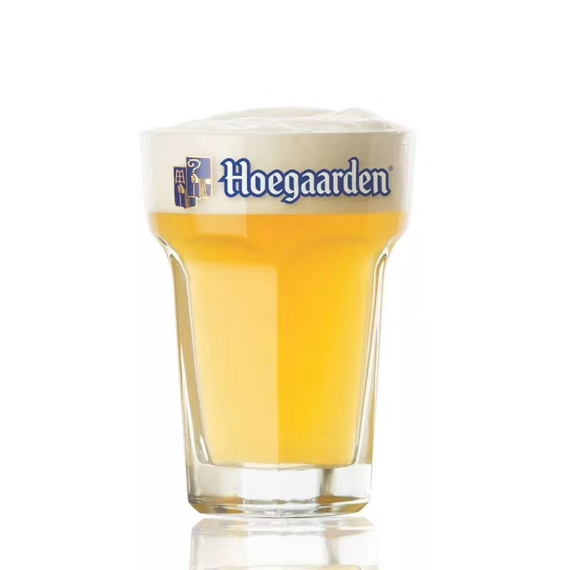
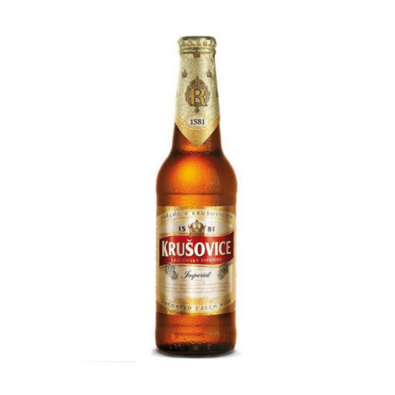
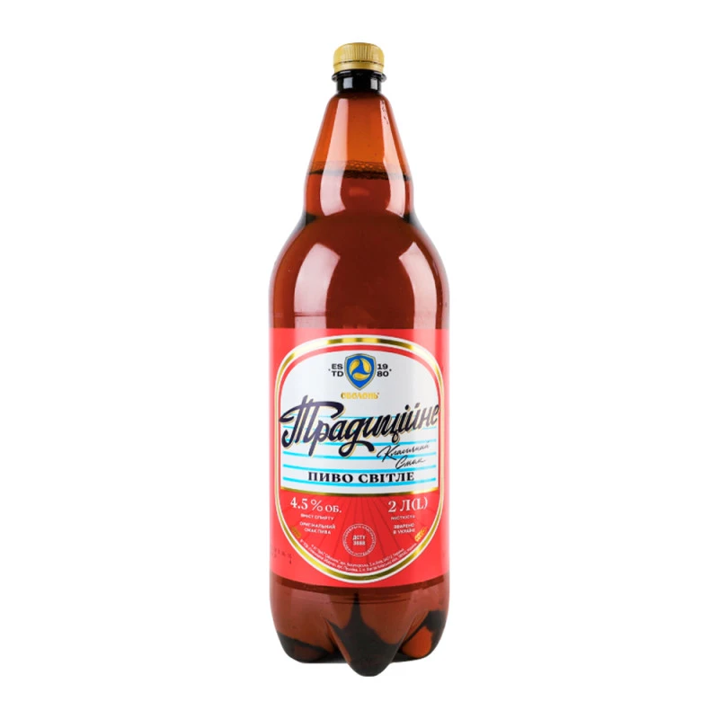
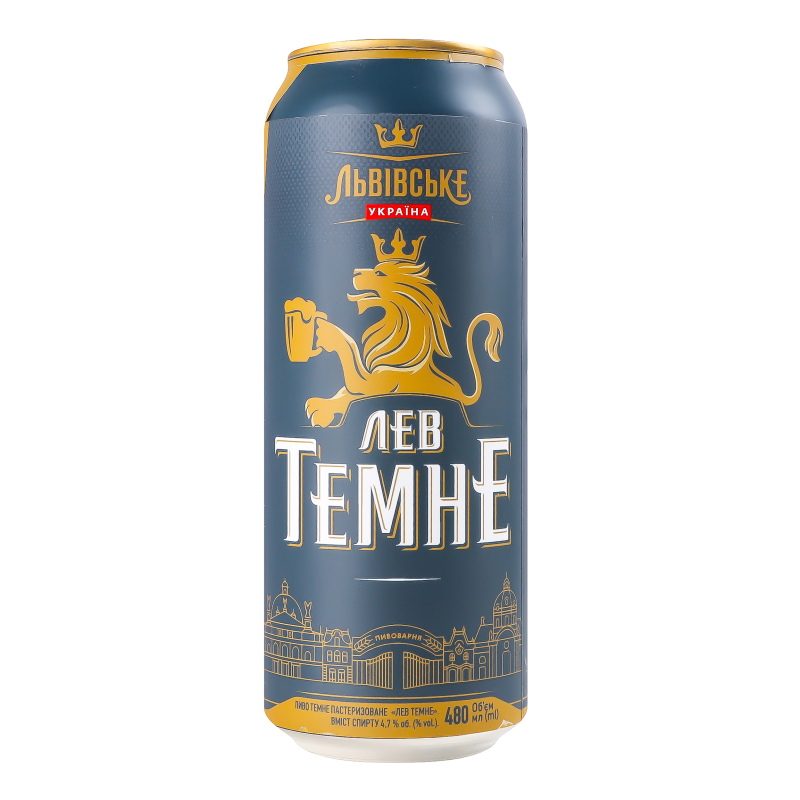
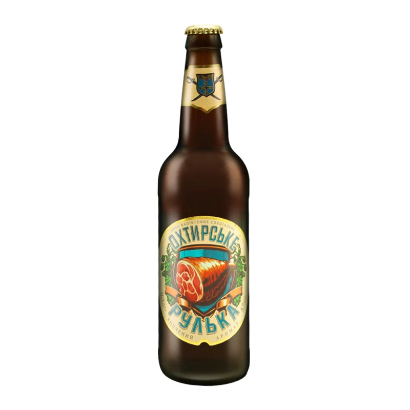
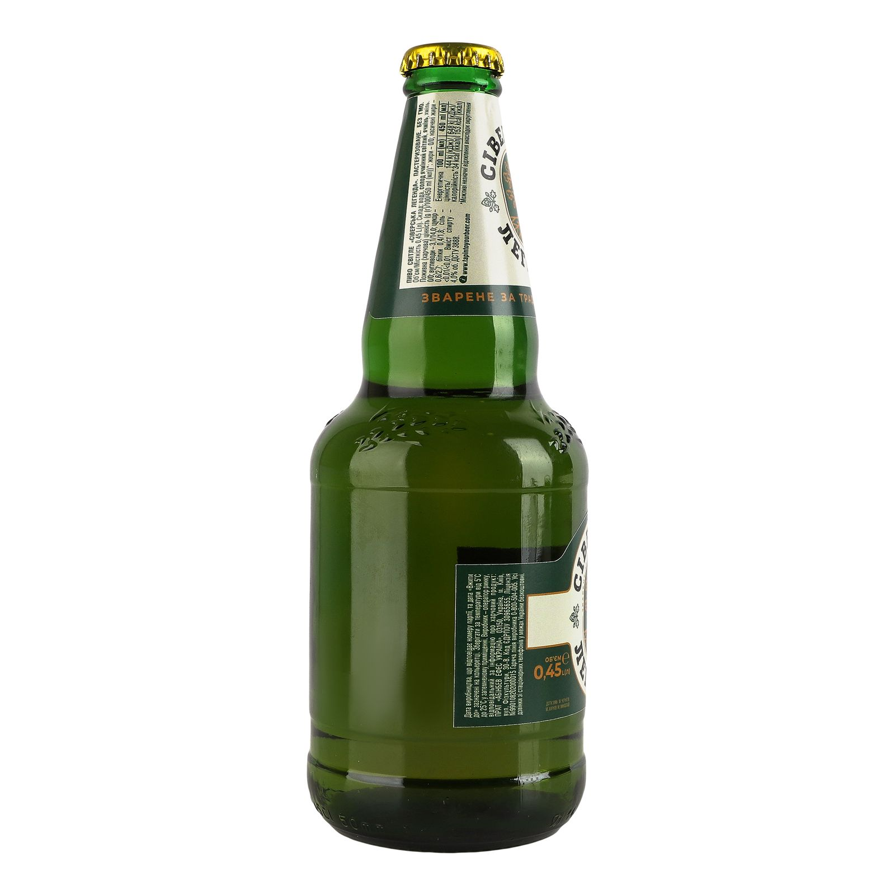
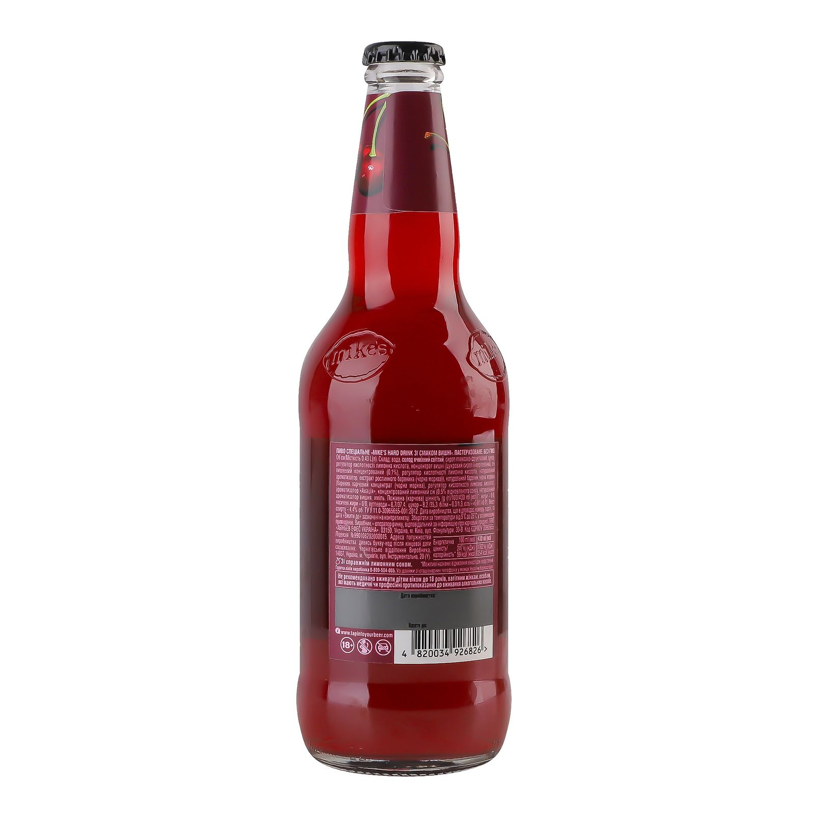
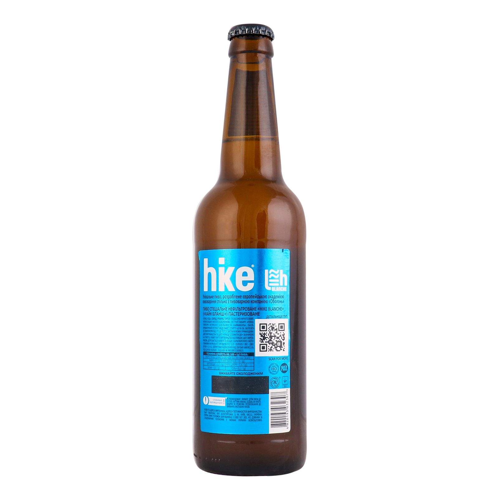
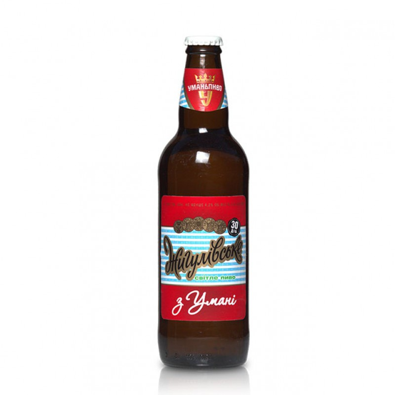
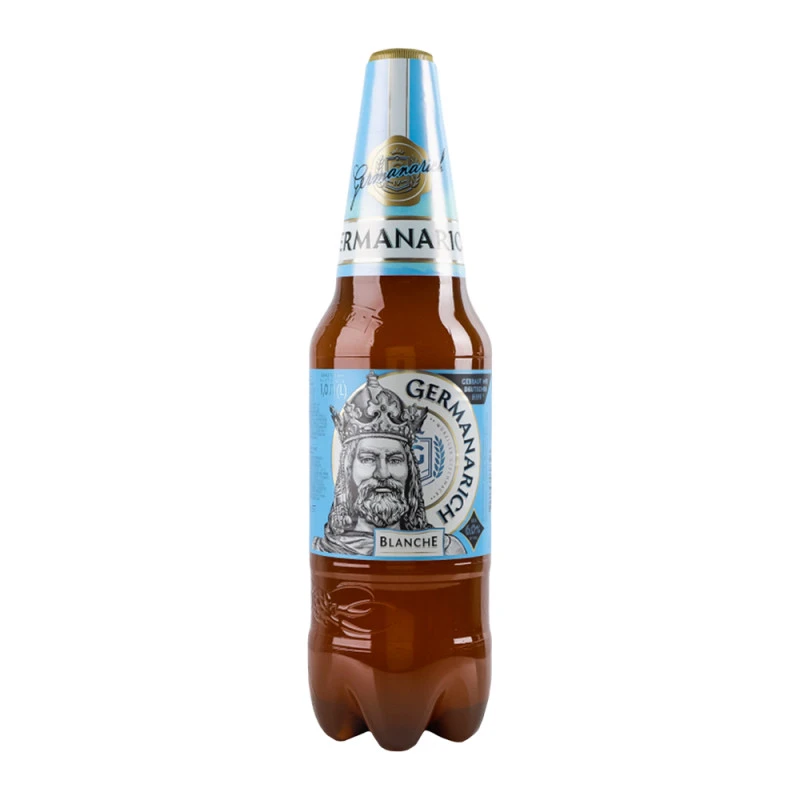

<!DOCTYPE html>
<html lang="uk">
<head>
<meta charset="UTF-8">
<title>Beer store</title>
<link rel="stylesheet" href="stylesGrid.css">
</head>
<body>
    <map name="contactsmap">
      <area shape="rect" coords="20,10,90,90" href="https://discord.com" alt="Discord">
      <area shape="rect" coords="110,10,190,90" href="https://web.telegram.org/k/" alt="Telegram">
      <area shape="rect" coords="200,10,290,90" href="https://www.instagram.com/cpp.whugs/?hl=ua" alt="Instagram">
    </map>

  <header>
  <h1>Бережіть воду – пийте пиво!</h1></header>
  

  <h2>Ваш Кошик:</h2>
  Кошик порожній
  

  
<h2>Пиво</h2>

  

  

    

      
      <h3>Пиво Zibert</h3>
      
40 грн/1 літр

    

    

      
      <h3>Пиво Hoegarden</h3>
      
45 грн/1 літр

    

    

      
      <h3>Пиво Крушовіце</h3>
      
35 грн/1 літр

    

    

      
      <h3>Пиво Традиційне</h3>
      
30 грн/1 літр

    

    

      
      <h3>Пиво темне Львівське</h3>
      
45 грн/1 літр

    

    

      
      <h3>Пиво темне Охтирське</h3>
      
30 грн/1 літр

    
 
    

      
      <h3>Пиво Сіверська Легенда</h3>
      
50 грн/1 літр

    
 
    

      
      <h3>Пиво Mike`s Hard Drink Cherry</h3>
      
45 грн/1 літр

    
 
    

      
      <h3>Пиво Hike Blanche</h3>
      
55 грн/1 літр

    
 
    

      
      <h3>Пиво Жигулівське</h3>
      
29 грн/1 літр

    
 
    

      
      <h3>Пиво Germanarich Blanche</h3>
      
49 грн/1 літр

    
 
  

  

        <h2>Меню</h2>
    <ul>
      <li><a href="index.html">Grid CSS</a></li>
      <li>Flex CSS</a></li>
      <li>Just CSS</a></li>
    </ul>
  

  

У п’ятницю – щасливі години:

 -20% на все пиво!

  <footer><h1>Зворотній зв'язок за номером +380661234567</h1>
    
    </footer>

</body>
</html>
